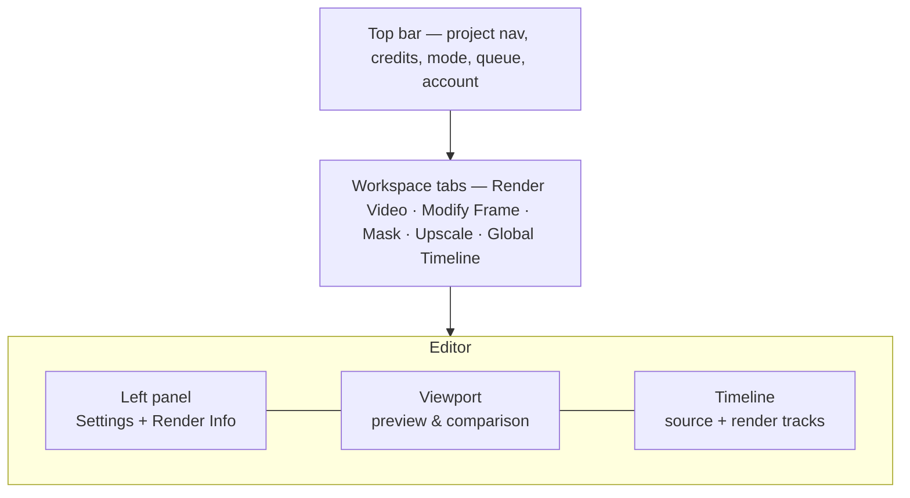

# Application Layout

[← Getting Started](getting-started) · [User Guide](README) · [Next: Projects, Shots & Renders →](projects-shots-renders)

---

The Mago editor is a single-page application organized into five persistent surfaces. Knowing where each lives makes the rest of the documentation easier to navigate.

| Surface | Location | Purpose |
| --- | --- | --- |
| **Top bar** | Top of screen | Project navigation, share, credit balance, mode toggle, pricing, queue, account menu |
| **Workspace tabs** | Below the top bar | Switch between the five workspaces |
| **Left panel** | Left side | Settings for the next render, and Render Info for inspecting any track |
| **Viewport** | Center | Video preview, comparison views, frame navigation, zoom, downloads |
| **Timeline** | Right side | Vertical timeline: the source track and all render tracks for the current shot |

## Top bar

> 📸 **Screenshot needed:** `app-layout/top-bar.png`
> _Annotated top bar._

- **Mago logo** — returns to the home view from anywhere.
- **Project name** — the current project. Click to navigate.
- **Shot name** — the current shot. Click for the shot list; the ℹ️ icon opens [shot statistics](projects-shots-renders#project-statistics).
- **Credit balance** — real-time available credits. Updates after each render.
- **Relaxed toggle** — switches between Credits mode and [Relaxed mode](credits-plans-modes#relaxed-mode). Greyed out on the Free plan.
- **Pricing** — opens the plans and credit packs page.
- **Queue** — counter of in-progress and waiting jobs. Click to expand the [full queue](credits-plans-modes#the-queue).
- **Account avatar** — account menu (settings, billing, support).

## Workspace tabs

The five tabs determine the task being performed. Settings, viewport content, and timeline behavior all change with the active tab.

| Tab | Icon hint | Use for |
| --- | --- | --- |
| [Render Video](workspaces/render-video) | Video camera | Video-to-video generation. The main workspace. |
| [Modify Frame](workspaces/modify-frame) | Paint bucket | Keyframe or reference frame generation |
| [Mask](workspaces/mask) | Contrasted circle in a rectangle | Mask generation for use with Inpainting |
| [Upscale](workspaces/upscale) | Bright gem | Resolution and detail enhancement |
| [Global Timeline](workspaces/global-timeline) | Horizontal editing bars | Cross-shot review using pinned renders |

> 📸 **Screenshot needed:** `app-layout/workspace-tabs.png`
> _The five workspace tabs._

> **💡 Tip** — Switching workspaces never loses work. Settings configured in one workspace are preserved when you return, and renders remain visible as tracks. Use **Edit this Render** on a track to carry a render into another workspace as the new source.

The left panel and viewport are detailed in [Timeline & tracks](timeline-and-tracks) and [Viewport & comparison](viewport-and-comparison).

---

[← Getting Started](getting-started) · [User Guide](README) · [Next: Projects, Shots & Renders →](projects-shots-renders)
