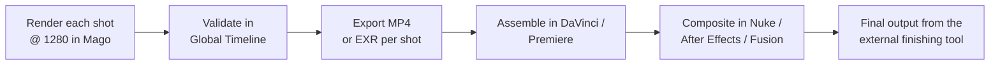

# Export & Compositing

[← Troubleshooting](/guide/troubleshooting) · [User Guide](/guide/overview) · [Next: Help & support →](/guide/help-and-support)

---

Mago is **not a finishing tool.** Final assembly happens in an external editor or compositing software. Mago exports per-track, and you assemble the final piece elsewhere.

## Per-track export options

| Output | How | Use case |
| --- | --- | --- |
| **MP4 video** | Direct download button on the track | Quick share, social, internal review |
| **MP4 with embedded info** | 3-dot menu | Production review with a visible settings overlay |
| **PNG sequence** | 3-dot menu | Frame-by-frame editing in external tools |
| **EXR 16-bit sequence** | 3-dot menu (only if EXR enabled in Advanced) | Professional VFX pipelines |
| **Video + images ZIP** | 3-dot menu | Archival or sharing a complete render |
| **Side-by-side comparison video** | Share button in the viewport (finished renders only) | Client review showing before/after |

## Modify Frame exports

Every generated image in [Modify Frame](/guide/workspaces/modify-frame) has its own download action — useful for exporting frames to another tool, building a reference frame library, or sharing specific frames.

## Mask export

Masks from the [Mask workspace](/guide/workspaces/mask) can be downloaded. Combined with the original source and the inpainting output, this enables **pixel-perfect compositing** in external tools — the workaround for the slight pixel shifts video models introduce in unmasked regions.

## EXR for VFX pipelines

EXR 16-bit export is available for **Mago Transform** and **Mago Style Transfer**. To enable:

1. In the **Advanced** tab, set **Include image sequence export** to **EXR 16-bit**.
2. Render the clip.
3. In the track's 3-dot menu, select **Export as EXR**.
4. The EXR sequence downloads as a ZIP.

EXR allows full dynamic range, higher color depth, and lossless compositing — required for studio finishing pipelines.

## Recommended external pipeline

1. Render each shot at 1280 (lower if budget-constrained).
2. Validate the look in the [Global Timeline](/guide/workspaces/global-timeline).
3. Export each shot as MP4 for review or EXR for finishing.
4. Assemble in DaVinci Resolve, Premiere, or similar.
5. Composite in Nuke, After Effects, or Fusion if needed.
6. Output the final piece from the external finishing tool — **not** from Mago.

---

[← Troubleshooting](/guide/troubleshooting) · [User Guide](/guide/overview) · [Next: Help & support →](/guide/help-and-support)
