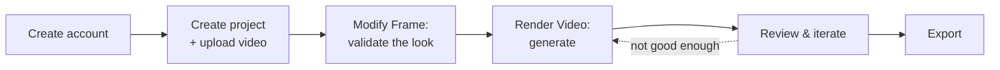

# Getting Started

[← Introduction](introduction) · [User Guide](README) · [Next: Application Layout →](app-layout)

---

This walkthrough takes you through your first end-to-end render. The golden habit to learn from day one: **validate your look on a single frame before spending credits on video.**

## 1. Create an account

Sign up at [mago.studio](https://www.mago.studio/) and open the app at [app.mago.studio](https://app.mago.studio/). On the home screen you'll find:

- A video tutorial to get you started, linking to the Mago YouTube channel.
- An invitation to join the [Discord community](https://www.mago.studio/) where Mago creatives connect, share work, and get help.
- Your credit balance and a **Pricing** tab in the top-right corner.

## 2. Create a project

The home page is your starting point — return to it anytime by clicking the Mago logo (top-left).

1. Click **Create Project**.
2. Name the project (double-click the name later to rename).
3. Upload your source video. You can crop it at this stage if needed.
4. Your project now appears on the home screen.

> 📸 **Screenshot needed:** `getting-started/01-home-create-project.png`
> _Home screen with the **Create Project** button highlighted._

### A project with multiple shots

1. Click the name of your current shot, next to the project name, to open the list of shots in the project.
2. Click **Add Video** and select a file to add a new shot.
3. Organize shots into folders, rename, and manage them from here.
4. To work on a shot, click it, then close the shots panel. Repeat to switch shots.

> **📐 Design note** — A common mistake is uploading an entire scene as one source video. Split scenes into shots in an external editor first, then upload each shot. This makes iteration faster, settings more transferable, and review cleaner. See [Projects, shots & renders](projects-shots-renders).

## 3. Modify a frame (validate the look)

Before running a video render, validate the style on a single frame. **This is the most important habit to develop.**

1. Switch to the **Modify Frame** tab.
2. Select the most representative source frame. Navigate by dragging the red bar, typing a frame number, or using arrow keys.
3. Choose an image model such as **GPT Image 2**.
4. In the references box, add any images that help the model understand the look you're after.
5. Write your prompt, describing the changes *and* what to preserve — e.g. _"keep the original composition, keep the original outlines, keep the original character."_
6. Click **Generate Image**.
7. Review. To refine, click **Iterate** below the image — this uses that output as the new base.
8. Once satisfied, click **Use This**. You'll jump to Render Video with your keyframe set.

> 📸 **Screenshot needed:** `getting-started/03-modify-frame.png`
> _Modify Frame workspace with a generated result._

Full detail: [Modify Frame workspace](workspaces/modify-frame).

## 4. Render a video

1. Pick a model. Start with **Mago Style Transfer** to stay close to your original, or **Mago Transform** to turn it into something else.
2. Write a **descriptive** prompt for Mago models, or an **instruction** prompt for closed-source models. **Auto Prompt** gives you a starting point.
3. For more control, explore the **Advanced** tab — though defaults work well.
4. Click **Generate Render**.

> **🧪 Workflow** — Always test on an 80–150 frame range before committing to a full-clip render. Find the right model, prompt, and settings first; only run the full clip once the test result satisfies you.

Full detail: [Render Video workspace](workspaces/render-video).

## 5. Review and iterate

1. Click the new render track in the timeline to view it.
2. Compare against the source: click the render, then **Ctrl/Cmd + click** the source video to open the comparison view (split slider or side-by-side).
3. Not good enough? Click **Reuse Settings** (the arrows next to the track) to adjust and run a new render. You can launch multiple renders in parallel.

> **💡 Tip** — Launch two renders in parallel with slightly different prompts or settings, then compare side by side. Mago is designed to put you in a state of flow, not to wait for sequential renders.

> 📸 **Screenshot needed:** `getting-started/05-comparison-slider.png`
> _Split-slider comparison of a render vs. the source._

## 6. Export

1. Click the download icon to the left of the render track or image.
2. Video clips download as MP4, images as JPG.

More options (PNG/EXR sequences, side-by-side videos): [Export & compositing](export-and-compositing).

---

[← Introduction](introduction) · [User Guide](README) · [Next: Application Layout →](app-layout)
