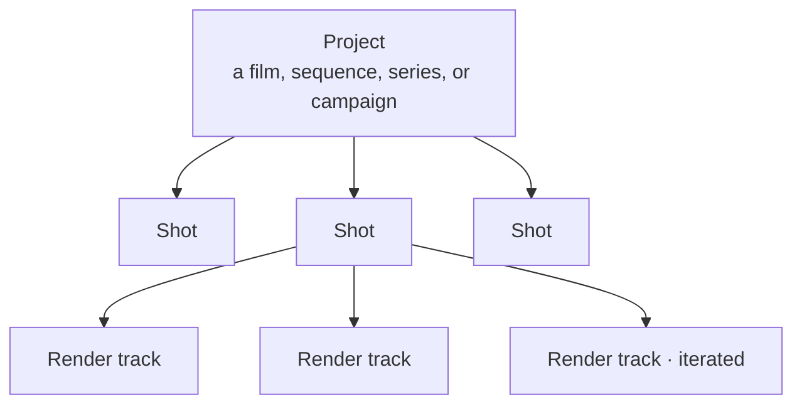

# Projects, Shots & Renders

[← Application Layout](app-layout.md) · [User Guide](README.md) · [Next: Credits, Plans & Modes →](credits-plans-modes.md)

---

Mago organizes work into a three-level hierarchy. Understanding it is essential to everything else.

| Level | Contains | Typical scope |
| --- | --- | --- |
| **Project** | Multiple shots, optionally in folders | A film, sequence, series, or campaign |
| **Shot** | Multiple render tracks, all from the same source video | A single shot from the project |
| **Render (track)** | One generated output | A single render attempt — many per shot |

## Project operations

- Create a new project from the Projects tab.
- Rename by double-clicking the project name in the top bar or project list.
- Delete from the project list.
- Search the project list by name.
- Sort by creation date or alphabetically, ascending or descending.
- Create folders, including nested subfolders.
- Drag projects into folders to organize.

## Shot operations

- Add a new shot inside the current project.
- Rename by double-clicking the shot name.
- Delete from the shot list.
- Search and sort within the project.
- Organize shots in folders.

> **📐 Design note** — Mago is built around shot-by-shot workflows. Don't upload an entire scene as one source video. Split scenes into shots in an external editor first, then upload each shot — it makes iteration faster, settings more transferable, and review cleaner.

## Project statistics

Each project has a statistics panel, opened via the ℹ️ icon next to the shot name. It shows:

- Total renders made on the project.
- Total frames generated.
- Total cost in credits.
- Cost per frame (average) and cost per second (average).
- Per-render breakdown: model, frame range, and credit cost.
- Most-used models on the project.

Useful for tracking the cost of arriving at a final look, and for reviewing which model and settings produced the best results.

## Render tracks

Every render produces a new track in the shot's vertical timeline, stacked below the source. Tracks can be rated, renamed, used as input for further renders (via **Edit this Render**), and downloaded.

Full detail: [Timeline & tracks](timeline-and-tracks.md).

---

[← Application Layout](app-layout.md) · [User Guide](README.md) · [Next: Credits, Plans & Modes →](credits-plans-modes.md)
