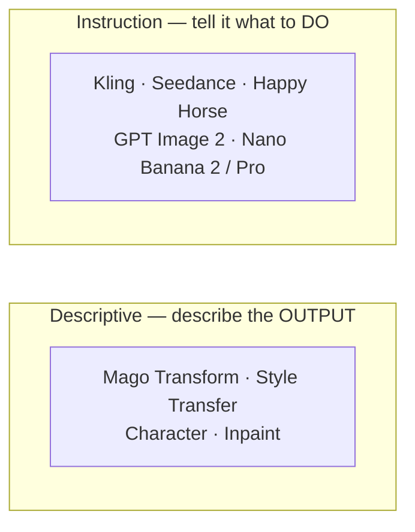

# Prompting Guide

[← Viewport & comparison](viewport-and-comparison) · [User Guide](index) · [Next: Workflows & recipes →](workflows-recipes)

---

Prompting is the highest-leverage skill in Mago. The same model can produce excellent or terrible results depending on the prompt.

## The two schools of prompting

Mago integrates two model families with **opposite** prompting philosophies.

| Approach | Models | Format | Example |
| --- | --- | --- | --- |
| **Descriptive** | All Mago video models | Describe the output | _"A medieval stone castle at dusk with torchlit walls"_ |
| **Instruction** | Closed-source video + all image models | Tell the model what to do | _"Change the building into a medieval stone castle. Keep the character, composition, and lighting."_ |

> **⚠️ Critical distinction** — Writing *instructions* to a Mago model produces poor results. Writing *descriptions* to a closed-source model often produces something, but less controlled. **Always match the prompt style to the model family.**

## Descriptive prompting (Mago models)

Describe the final image. Be specific about what the viewer should see. Use nouns and adjectives.

> **Prompting Mago Transform** — Task: turn an office scene into a wooden forest.
> ❌ _"Stylize the office as a wooden forest."_
> ✅ _"A dense temperate forest with tall oak and pine trees, soft golden light filtering through the canopy, mossy forest floor."_
> The model isn't being told to transform anything — it's being shown what the result should look like.

## Instruction prompting (closed-source & image models)

Tell the model what to change *and* what to keep. Use imperative verbs.

> **Prompting GPT Image 2** — Task: change the background building to a castle.
> ❌ _"castle"_
> ✅ _"Change the building in the background to a medieval stone castle. Keep the character in the foreground unchanged. Keep the original composition, lighting, and outlines."_
> The model needs preservation directives or it will change more than intended.

## Auto Prompt

Auto Prompt generates a starting prompt from a description of the source video, the action, and the reference image (if provided).

**Use it for:** a starting point when unsure how to describe a complex scene, quick prototyping, and adapting prompts when changing scenes (it adjusts to context — e.g. dropping human terms for a nature scene).

Available for: Mago Transform, Mago Style Transfer, Mago Inpaint, Mago Character, and Kling 2.6 Motion Control.

## Image references vs. prompts

For most video transformations, **an image reference is more powerful than a long prompt.** The image shows the model exactly what the result should look like; the prompt fills in motion, style direction, and edge cases.

Order of investment for best results:

1. Generate a strong reference image in [Modify Frame](workspaces/modify-frame).
2. Write a short descriptive prompt that matches.
3. Tune ControlNet and other settings only if results need refinement.

## Negative prompts

Available on some models. Use to exclude unwanted artifacts or content. Common values:

- low quality, blurry, distorted
- extra faces, extra limbs, deformed
- NSFW (in mixed contexts)
- text

---

[← Viewport & comparison](viewport-and-comparison) · [User Guide](index) · [Next: Workflows & recipes →](workflows-recipes)
