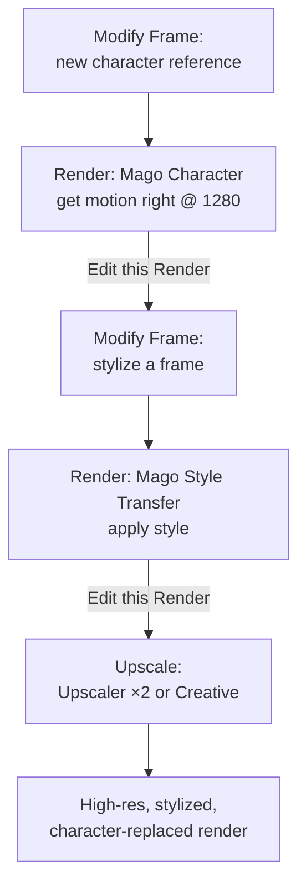

# Workflows & Recipes

[← Prompting guide](prompting-guide) · [User Guide](index) · [Next: Troubleshooting →](troubleshooting)

---

Complete, step-by-step workflows for common goals.

- [Stylize a live-action shot](#recipe-stylize-a-live-action-shot)
- [Replace a character](#recipe-replace-a-character)
- [Edit a specific element](#recipe-edit-a-specific-element)
- [Multi-pass pipeline (character + style + upscale)](#recipe-multi-pass-pipeline)

---

## Recipe: Stylize a live-action shot

**Goal:** change the visual style of acted footage while preserving the actor's performance, lip sync, and expressions.
**Model:** [Mago Style Transfer](../models/mago-video-models#mago-style-transfer).

1. Upload the source video to a new shot.
2. Open [Modify Frame](workspaces/modify-frame). Select a representative frame (usually one where the actor's face is visible).
3. Choose **GPT Image 2**. Write an instruction prompt with strong preservation: _"Change the visual style to oil painting with thick brushstrokes. Keep the character, composition, lighting, and proportions intact."_
4. Generate. Iterate until the frame matches the intended look.
5. Click **Use this** — the frame becomes the reference for the next render.
6. Switch to Render Video. Pick **Mago Style Transfer**.
7. Write a short descriptive prompt: _"An oil painting with thick visible brushstrokes, warm earth tones, painterly background."_
8. Set **Video input strength** to 0.8 to preserve the likeness of your actor.
9. Select an 80–150 frame range. Click **Generate**.
10. Review. Compare against the source with the split slider. Verify lip sync.
11. If satisfied, switch to **Generate Full Clip**. If not, adjust Video input strength or the reference image and re-render.

## Recipe: Replace a character

**Goal:** swap the character in a shot with a different character.
**Model:** [Mago Character](../models/mago-video-models#mago-character) or [Kling 3.0 Motion Control](../models/closed-source-video-models#kling-30-motion-control).

1. Upload the source video.
2. In Modify Frame, generate the new character matching the source pose. Use GPT Image 2: _"Replace the character with [new character description]. Keep the same pose, framing, and background."_
3. Iterate until the new character looks right and the pose matches.
4. Click **Use this**.
5. Switch to Render Video. Pick **Mago Character**.
6. Confirm the reference image is set.
7. Configure: Pose strength (lower for exact tracking), Face strength, Masking prompt to identify the character (_"person"_, _"woman in red"_).
8. If the new character has features beyond the original silhouette (horns, spiky hair, flowing clothes), increase **Grow mask** to 15–25.
9. Test on a small range. Verify face tracking, body tracking, and overall identity.
10. Adjust Face crop resolution if eyes appear closed; Grow mask if features are clipped.
11. Once satisfied, render the full clip.

> **💡 Alternative for lip sync** — If lip sync is critical, use Kling 3.0 Motion Control instead. Use a Modify Frame reference and leave the prompt empty at first.

## Recipe: Edit a specific element

**Goal:** change one element (a prop, clothing, an object) while leaving everything else untouched.
**Model:** [Mago Inpaint](../models/mago-video-models#mago-inpaint).

1. Open the [Mask](workspaces/mask) workspace.
2. Use Prompts or Points to mask the element. E.g. _"red car"_.
3. Generate. Compare the mask against the source with the slider. Verify coverage.
4. If too tight, increase **Expand**. If edges look hard, increase **Blur**.
5. Switch to Modify Frame. Generate a reference image showing what the element should become.
6. Click **Use this**.
7. Switch to Render Video. Pick **Mago Inpaint**.
8. Select the mask track and the reference image.
9. Write a descriptive prompt for the scene as it should look after the edit. E.g. _"A blue sedan in the parking lot."_
10. Render on a test range. Verify the unmasked regions are preserved.
11. If unmasked regions show slight changes (brightness shift), plan to [composite externally](export-and-compositing#mask-export) with the downloaded mask for pixel-perfect preservation.

## Recipe: Multi-pass pipeline

**Goal:** replace a character, apply a style, then upscale to high resolution. The flagship multi-pass workflow.

1. **Pass 1 (Modify Frame):** generate the new character reference matching the source pose.
2. **Pass 1 (Render, Mago Character):** replace the character. Get the motion right. Lower resolution (1280) is fine.
3. On the render track, click **Edit this Render** — the render becomes the source for the next pass.
4. **Pass 2 (Modify Frame):** take a frame from the character-replaced render. Apply the target visual style with GPT Image 2 and strong preservation directives.
5. Click **Use this**.
6. **Pass 2 (Render, Mago Style Transfer):** apply the style to the character-replaced render, using the stylized frame as reference.
7. On the stylized result, click **Edit this Render** again.
8. **Pass 3 (Upscale):** Upscaler ×2 for clean enlargement, or Creative Upscaler at denoise 0.3–0.5 for detail.
9. **Result:** a high-resolution, stylized, character-replaced render — produced through controllable, independently iterable steps.

> **📐 Why multi-pass** — Doing everything at once is unreliable: the models start fighting each other, and there's no way to fix one step without redoing all of it. Multi-pass takes longer but is dramatically more controllable for production work.

## Model selection quick reference

| Goal | Recommended | Alternative |
| --- | --- | --- |
| Transform an entire scene | Mago Transform | Kling 03 Pro, Seedance 2.0 |
| Restyle while preserving lip sync | Mago Style Transfer | Kling 3.0 Motion Control |
| Replace a character | Mago Character | Kling 3.0 Motion Control |
| Edit a specific element | Mago Inpaint | Happy Horse |
| Quick VFX, no precision needs | Happy Horse, Seedance 2.0 | Kling 03 Pro |
| Edit a single image | GPT Image 2 | Nano Banana 2 |
| Clean upscale | Upscaler | Creative Upscaler (low denoise) |
| Restoration upscale with detail | Creative Upscaler | Mago Style Transfer (heavy restorations) |
| Style transfer at the image level | GPT Image 2 | Seedream |
| Character prep for video | GPT Image 2 / Nano Banana Pro | MAGO Pose Transfer |

---

[← Prompting guide](prompting-guide) · [User Guide](index) · [Next: Troubleshooting →](troubleshooting)
