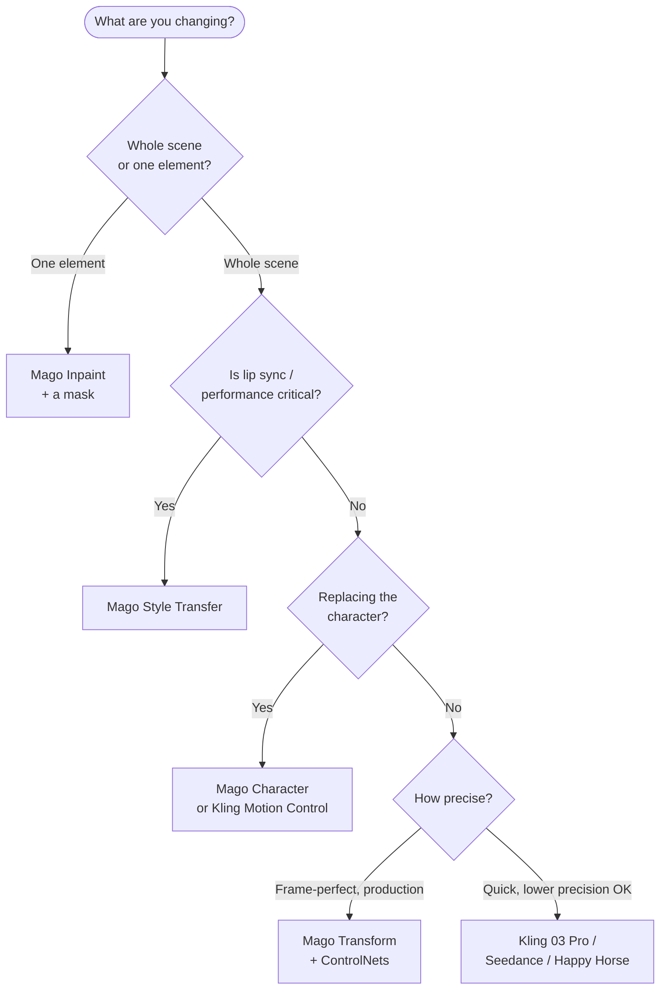

# Model Catalog

Mago integrates two families of video models plus image and upscale models. This section is the **single source of truth** for what each model does and how to configure it — the [user guide](/guide/overview) links here rather than duplicating specs.

## The two families

The most important distinction in all of Mago:

| | **Mago models** | **Closed-source models** |
| --- | --- | --- |
| Prompt style | **Descriptive** (describe the result) | **Instruction** (tell it what to do) |
| Frame correspondence | Frame-perfect: N in = N out | Approximate, may drift |
| Settings exposure | High (more control, steeper curve) | Low (easier to start) |
| Cost per render | Generally lower | Generally higher |
| Relaxed mode | ✅ Available | ❌ Always consume credits |
| Best fit | Long-form, precision, production | Quick shots, prototypes |

See the [Prompting guide](/guide/prompting-guide) for why prompt style matters so much.

## Catalog

| Page | Models |
| --- | --- |
| [Mago video models](/models/mago-video-models) | Mago Transform · Mago Style Transfer · Mago Character · Mago Inpaint |
| [Closed-source video models](/models/closed-source-video-models) | Kling 01 / 03 Pro · Kling 2.6 / 3.0 Motion Control · Seedance 2.0 · Happy Horse |
| [Image models](/models/image-models) | GPT Image 2 · Nano Banana Pro · Nano Banana 2 · legacy models |
| [Upscale models](/models/upscale-models) | Upscaler · Creative Upscaler |

## Which model should I use?

Quick reference (full version with alternatives in [the settings cheat sheet](/reference/settings-cheat-sheet)):

| Goal | Recommended | Alternative |
| --- | --- | --- |
| Transform an entire scene | Mago Transform | Kling 03 Pro, Seedance 2.0 |
| Restyle while preserving lip sync | Mago Style Transfer | Kling 3.0 Motion Control |
| Replace a character | Mago Character | Kling 3.0 Motion Control |
| Edit a specific element | Mago Inpaint | Happy Horse |
| Quick VFX, no precision needs | Happy Horse, Seedance 2.0 | Kling 03 Pro |
| Edit a single image | GPT Image 2 | Nano Banana 2 |
| Clean upscale | Upscaler | Creative Upscaler (low denoise) |
| Restoration upscale with detail | Creative Upscaler | — |

### Decision tree

A fuller decision tree including image and upscale work lives in the [model decision tree reference](/reference/settings-cheat-sheet#model-decision-tree).
