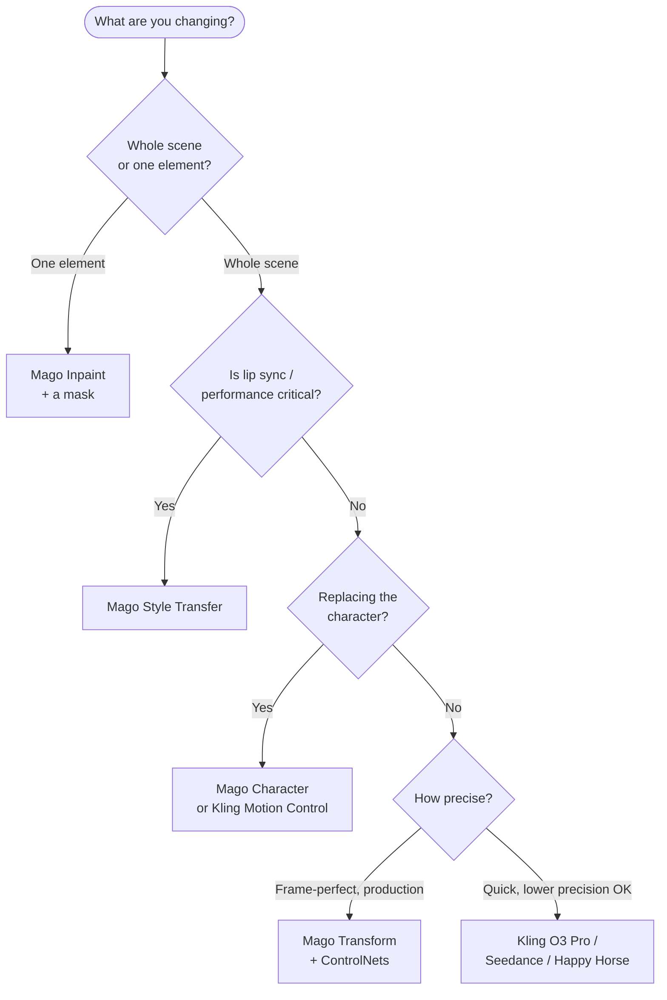

# Model Catalog

Mago integrates two families of video models plus image and upscale models. This section is the **single source of truth** for what each model does and how to configure it — the [user guide](/guide/overview) links here rather than duplicating specs.

## The two families

The most important distinction in all of Mago:

| | **Mago models** | **Closed-source models** |
| --- | --- | --- |
| Prompt style | **Descriptive** (describe the result) | **Instruction** (tell it what to do) |
| Frame correspondence | Frame-perfect: N in = N out | Approximate, may drift |
| Settings exposure | High (more control, steeper curve) | Low (easier to start) |
| Cost per render | Generally lower | Generally higher |
| Relaxed mode (Pro) | ✅ Available | ❌ Not available |
| Unlimited mode (Studio) | ✅ Available | ✅ Available |
| Best fit | Long-form, precision, production | Quick shots, prototypes |

See the [Prompting guide](/guide/prompting-guide) for why prompt style matters so much.

## Availability by mode

Which models can render without credits. See [Relaxed and Unlimited modes](/guide/credits-plans-modes#relaxed-mode) for plans and limits. A model marked ❌ is only usable in Credits mode (or Unlimited mode on Studio, where marked).

| Model | Relaxed mode (Pro) | Unlimited mode (Studio) |
| --- | --- | --- |
| Mago Transform · Style Transfer · Character · Inpaint · Clean Plate | ✅ | ✅ |
| Upscaler · Creative Upscaler · Mago SDR-to-HDR | ✅ | ✅ |
| Kling O1 / O3 Pro · Kling 2.6 / 3.0 Motion Control | ❌ | ✅ |
| Seedance 2.0 · Seedance 2.0 Image-to-Video · Seedance 2.5 | ❌ | ✅ |
| Happy Horse 1.0 | ❌ | ✅ |
| GPT Image 2 | ✅ | ✅ |
| Nano Banana Pro · Nano Banana 2 · Seedream 5.0 Pro · Qwen Image Edit + | ❌ | ✅ |
| Script project reference image models | Credits only | Credits only |

## Catalog

| Page | Models |
| --- | --- |
| [Mago video models](/models/mago-video-models) | Mago Transform · Mago Style Transfer · Mago Character · Mago Inpaint · Mago Clean Plate |
| [Closed-source video models](/models/closed-source-video-models) | Kling O1 / O3 Pro · Kling 2.6 / 3.0 Motion Control · Seedance 2.0 · Seedance 2.0 Image-to-Video · Seedance 2.5 · Happy Horse |
| [Image models](/models/image-models) | GPT Image 2 · Nano Banana Pro · Nano Banana 2 · Seedream 5.0 Pro · Qwen Image Edit + |
| [Upscale models](/models/upscale-models) | Upscaler · Creative Upscaler · Mago SDR-to-HDR |

## Which model should I use?

Quick reference (full version with alternatives in [the settings cheat sheet](/reference/settings-cheat-sheet)):

| Goal | Recommended | Alternative |
| --- | --- | --- |
| Transform an entire scene | Mago Transform | Kling O3 Pro, Seedance 2.0 |
| Restyle while preserving lip sync | Mago Style Transfer | Kling 3.0 Motion Control |
| Replace a character | Mago Character | Kling 3.0 Motion Control |
| Edit a specific element | Mago Inpaint | Happy Horse |
| Remove a subject and recover the empty background | Mago Clean Plate | — |
| Quick VFX, no precision needs | Happy Horse, Seedance 2.0 | Kling O3 Pro |
| Edit a single image | GPT Image 2 | Nano Banana 2 |
| Clean upscale | Upscaler | Creative Upscaler (low detail enhancement) |
| Restoration upscale with detail | Creative Upscaler | — |
| Expand brightness and colour range for HDR | Mago SDR-to-HDR | — |

### Decision tree

```mermaid
flowchart TD
  Start([What are you changing?]) --> Whole{Whole scene<br/>or one element?}
  Whole -->|One element| Inpaint[Mago Inpaint<br/>+ a mask]
  Whole -->|Whole scene| Perf{Is lip sync /<br/>performance critical?}
  Perf -->|Yes| Style[Mago Style Transfer]
  Perf -->|No| Char{Replacing the<br/>character?}
  Char -->|Yes| CharModel[Mago Character<br/>or Kling Motion Control]
  Char -->|No| Precision{How precise?}
  Precision -->|Frame-perfect, production| Transform[Mago Transform<br/>+ ControlNets]
  Precision -->|Quick, lower precision OK| Closed[Kling O3 Pro /<br/>Seedance / Happy Horse]
```

A fuller decision tree including image and upscale work lives in the [model decision tree reference](/reference/settings-cheat-sheet#model-decision-tree).
