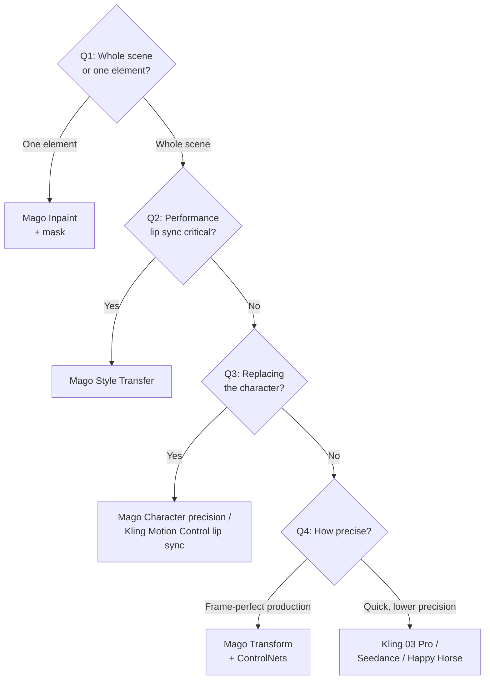

# Settings Cheat Sheet

[← Quick reference](index)

---

Quick lookup of defaults, ranges, and when to change each setting. Full per-model context lives in the [Model catalog](../models/index).

## Universal settings (Mago video models)

Defaults and ranges below reflect the current model configs: universal settings from Mago V5, Character settings from Mago V4, Upscaler settings from the Mago upscaler model.

| Setting                | Default | Range            | When to change                                                        |
| ---------------------- | ------- | ---------------- | --------------------------------------------------------------------- |
| Output size            | 1280    | 512–1920         | Lower for testing. Higher for final delivery. 1280 is the sweet spot. |
| Steps                  | 4       | 4–20             | More for sharper detail (costs more). Lower for rougher styles.       |
| Interpolation          | Off     | Off/On           | On for cheaper, faster renders. Off for detail-critical work. Exception: **Mago Inpaint defaults to On** (less flicker in the masked region). |
| Image sequence export  | PNG     | PNG / EXR 16-bit | EXR for professional VFX pipelines.                                   |
| Prompt influence (CFG) | 1       | 0.5–6            | Lower if the prompt over-influences. Higher if the model ignores it.  |
| Seed                   | Random  | 0–4294967295     | Fix to reproduce a specific result.                                   |
| Context size           | 150     | 24–300           | Lower for high movement. Higher for static.                           |
| Context overlap        | 10      | 0–24             | Lower for high movement. Higher for slow shots.                       |
| Dynamic reference      | On      | On/Off           | Off only for very static shots.                                       |
| Start frame buffer     | 1       | 1 or 5           | Increase if flicker appears at render start.                          |

## Mago Character specific

| Setting              | Default   | When to change                                                 |
| -------------------- | --------- | -------------------------------------------------------------- |
| Pose strength        | 1         | Lower for exact tracking. Higher for stylistic freedom.        |
| Face strength        | 1         | Lower for precise expression replication. Higher for stylized. |
| Face crop resolution | 512       | 768/1024 for high-res output or eye issues.                    |
| Face crop padding    | 10        | 10–20 if facial features clipped.                              |
| Masking threshold    | 0.3       | 0.1–0.2 if detection failing. 0.4–0.6 if too much detected.    |
| Masking prompt       | character | Multi-subject shots need specifics.                            |
| Grow mask            | 10        | 15–25 for spiky hair, horns, flowing clothes.                  |
| Relight              | 1         | Slider 0–1.5. Lower toward 0 to reduce lighting correction; above 1 strengthens it but may affect other aspects.        |

## Mago Style Transfer specific

| Setting              | Default | When to change                                                |
| -------------------- | ------- | ------------------------------------------------------------- |
| Video input strength | 0.5     | Below 0.5 for shots over 80 frames. Higher to lock to source. |

## Creative Upscaler specific

| Setting                   | Range             | When to use                                                                   |
| ------------------------- | ----------------- | ----------------------------------------------------------------------------- |
| Denoise                   | 0.1–0.9           | 0.3 light detail · 0.5 moderate · 0.7–0.8 heavy restoration of damaged input. |
| Tile width / height count | Higher for detail | Risk of visible tiling at high counts.                                        |

---

## Model decision tree

Follow the questions in order.

### Video work

### Image work (Q5: what are you doing with the image?)

- **Edit a specific element** → GPT Image 2 (use the mask image input if region-specific).
- **General style transfer or transformation** → Nano Banana Pro.
- **Need 4K output** → Nano Banana 2.
- **Character preparation matching source pose** → GPT Image 2 or Nano Banana Pro.

### Upscale work (Q6: is the input already what you want, just the wrong size?)

- **Yes** → Upscaler at ×2 or ×4.
- **No, needs reconstruction or detail** → Creative Upscaler. Set denoise by how much reconstruction you want.

### Single pass or multi-pass? (Q7: how complex is the transformation?)

- **Simple, single change** → single pass with the right model.
- **Multiple changes (character + style + upscale)** → [multi-pass](../guide/workflows-recipes#recipe-multi-pass-pipeline) using _Edit this Render_ between stages.
- **Long-form, production work** → always multi-pass. The control is worth the extra time.

---

[← Quick reference](index)
