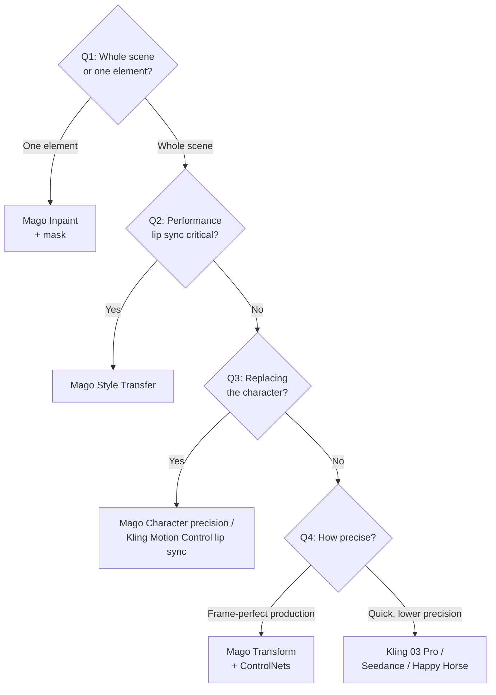

# Settings Cheat Sheet

[← Quick reference](/reference/overview)

---

Quick lookup of defaults, ranges, and when to change each setting. Full per-model context lives in the [Model catalog](/models/overview).

## Universal settings (Mago video models)

Defaults and ranges below reflect the current model configs: universal settings from Mago V5, Character settings from Mago V4, Upscaler settings from the Mago upscaler model.

| Setting                | Default | Range            | When to change                                                                                                                                |
| ---------------------- | ------- | ---------------- | --------------------------------------------------------------------------------------------------------------------------------------------- |
| Output size            | 1280    | 512–1920         | Lower for testing. Higher for final delivery. 1280 is the sweet spot.                                                                         |
| Steps                  | 4       | 4–20             | More for sharper detail (costs more). Lower for rougher styles.                                                                               |
| Interpolation          | Off     | Off/On           | On for cheaper, faster renders. Off for detail-critical work. Exception: **Mago Inpaint defaults to On** (less flicker in the masked region). |
| Image sequence export  | PNG     | PNG / EXR 16-bit | EXR for professional VFX pipelines.                                   |
| Prompt strength        | 1       | 0.5–6            | Lower if the prompt over-influences. Higher if the model ignores it.  |
| Seed                   | 42      | 0–4294967295     | Fix to reproduce a specific result.                                   |
| Context size           | 150     | 24–300           | Lower for high movement. Higher for static.                           |
| Context overlap        | 10      | 0–24             | Lower for high movement. Higher for slow shots.                       |
| Dynamic reference      | On      | On/Off           | Off only for very static shots.                                       |
| Accelerator            | 1       | 0–1              | Lower for more natural, detailed output; higher for faster renders.   |

## Mago Character specific

| Setting              | Default   | When to change                                                 |
| -------------------- | --------- | -------------------------------------------------------------- |
| Pose strength        | 1         | Range 0.5–1.5. Lower for exact tracking. Higher for stylistic freedom.  |
| Face strength        | 1         | Range 0.5–1.5. Lower for precise expression replication. Higher for stylized. |
| Grow face mask       | 50        | Range 0–200. Increase to include overlapping features (big eyebrows, long chin). |
| Relight              | 1         | Range 0–1.5. Lower toward 0 to keep the reference lighting; higher adapts to the background. |
| Color correction     | Off       | Turn on if render colors become over-saturated or over-exposed.        |
| Masking threshold    | 0.3       | Replacement mode only. Lower (→0.1) if detection failing; higher if too much detected. |
| Masking prompt       | character | Replacement mode only. Multi-subject shots need specifics.             |
| Grow Mask            | 10        | Replacement mode only. 15–25 for spiky hair, horns, flowing clothes.   |

## Mago Style Transfer specific

| Setting              | Default | When to change                                                |
| -------------------- | ------- | ------------------------------------------------------------- |
| Video input strength | 0.5     | Below 0.5 for shots over 80 frames. Higher to lock to source. |
| Level of detail      | 40%     | Range 20–80%. Higher renders finer details and textures.      |

## Creative Upscaler specific

| Setting                   | Range             | When to use                                                                   |
| ------------------------- | ----------------- | ----------------------------------------------------------------------------- |
| Detail enhancement        | 0.1–0.9           | 0.3 light detail · 0.5 moderate · 0.7–0.9 heavy restoration of damaged input. |
| Tile width / height count | Higher for detail | Risk of visible tiling at high counts.                                        |

---

## Model decision tree

Follow the questions in order.

### Video work

```mermaid
flowchart TD
  Q1{Q1: Whole scene<br/>or one element?}
  Q1 -->|One element| Inpaint[Mago Inpaint<br/>+ mask]
  Q1 -->|Whole scene| Q2{Q2: Performance<br/>lip sync critical?}
  Q2 -->|Yes| Style[Mago Style Transfer]
  Q2 -->|No| Q3{Q3: Replacing<br/>the character?}
  Q3 -->|Yes| CharModel[Mago Character precision /<br/>Kling Motion Control lip sync]
  Q3 -->|No| Q4{Q4: How precise?}
  Q4 -->|Frame-perfect production| Transform[Mago Transform<br/>+ ControlNets]
  Q4 -->|Quick, lower precision| Closed[Kling 03 Pro /<br/>Seedance / Happy Horse]
```

### Image work (Q5: what are you doing with the image?)

- **Edit a specific element** → GPT Image 2 (use the mask image input if region-specific).
- **General style transfer or transformation** → Nano Banana Pro.
- **Need 4K output** → Nano Banana 2.
- **Character preparation matching source pose** → GPT Image 2 or Nano Banana Pro.

### Upscale work (Q6: is the input already what you want, just the wrong size?)

- **Yes** → Upscaler at ×2 or ×4.
- **No, needs reconstruction or detail** → Creative Upscaler. Set denoise by how much reconstruction you want.

### Single pass or multi-pass? (Q7: how complex is the transformation?)

- **Simple, single change** → single pass with the right model.
- **Multiple changes (character + style + upscale)** → [multi-pass](/guide/workflows-recipes#recipe-multi-pass-pipeline) using _Edit this Render_ between stages.
- **Long-form, production work** → always multi-pass. The control is worth the extra time.

---

[← Quick reference](/reference/overview)
